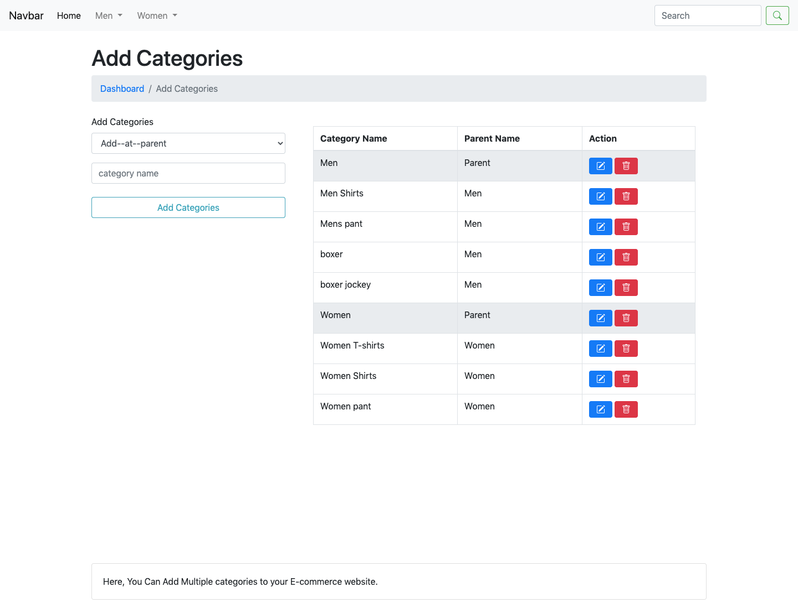
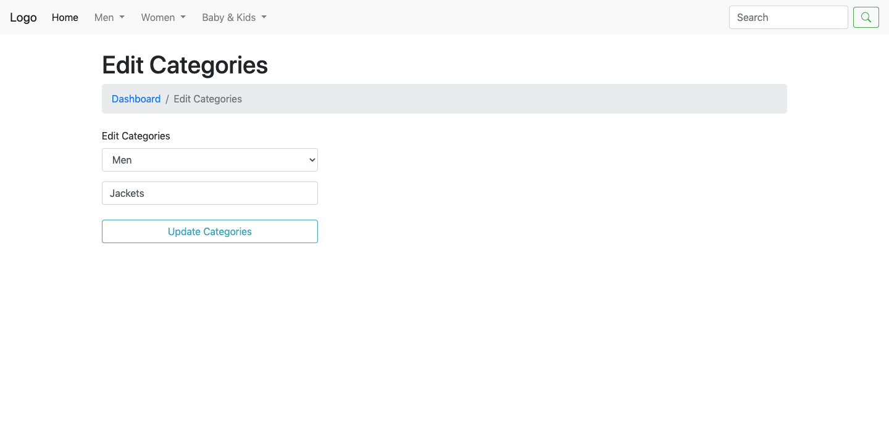
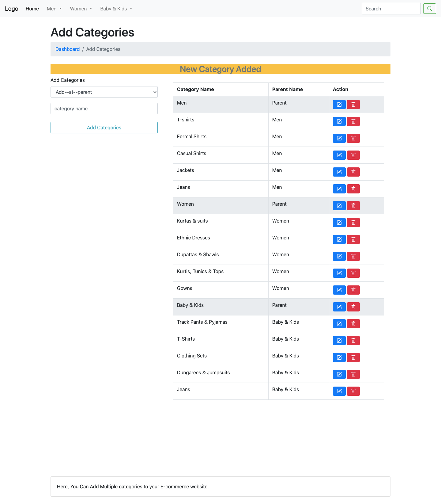
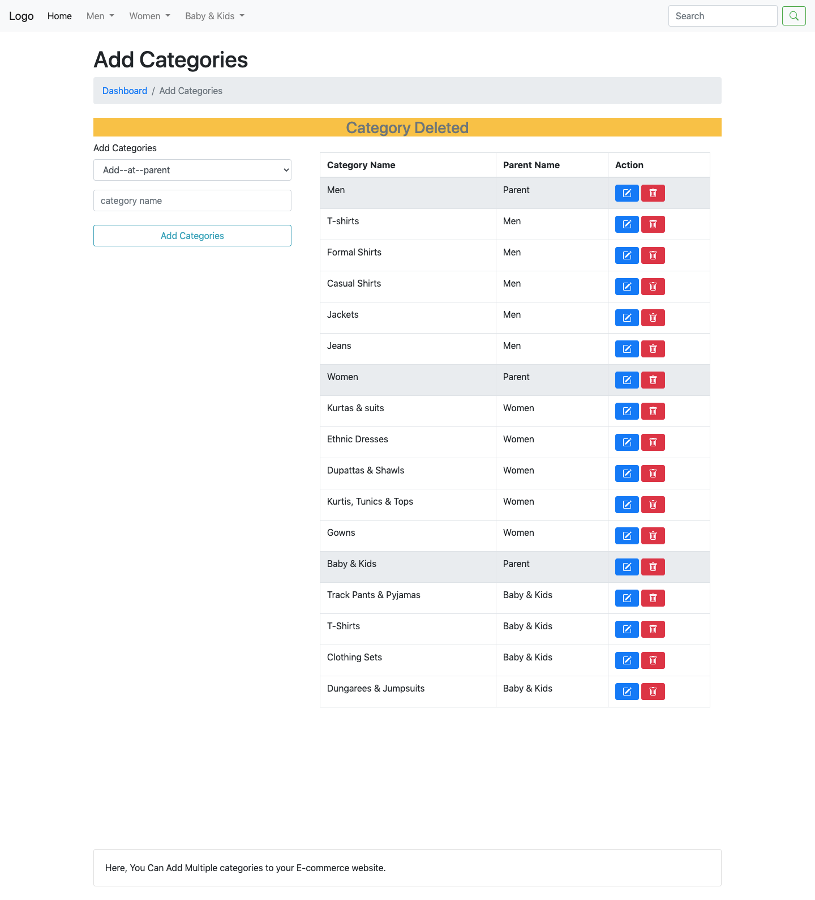

# Dynamic-Category-Subcategory-php-mysql-ajax
Dynamic-Category-Subcategory-php-mysql-ajax-ecommerce

### 1. Dropdown Sub-Category

### 2. Add Category

### 3. Edit Category

### 4. Update Category

### 5. Add New Category

### 6. Delete Category

